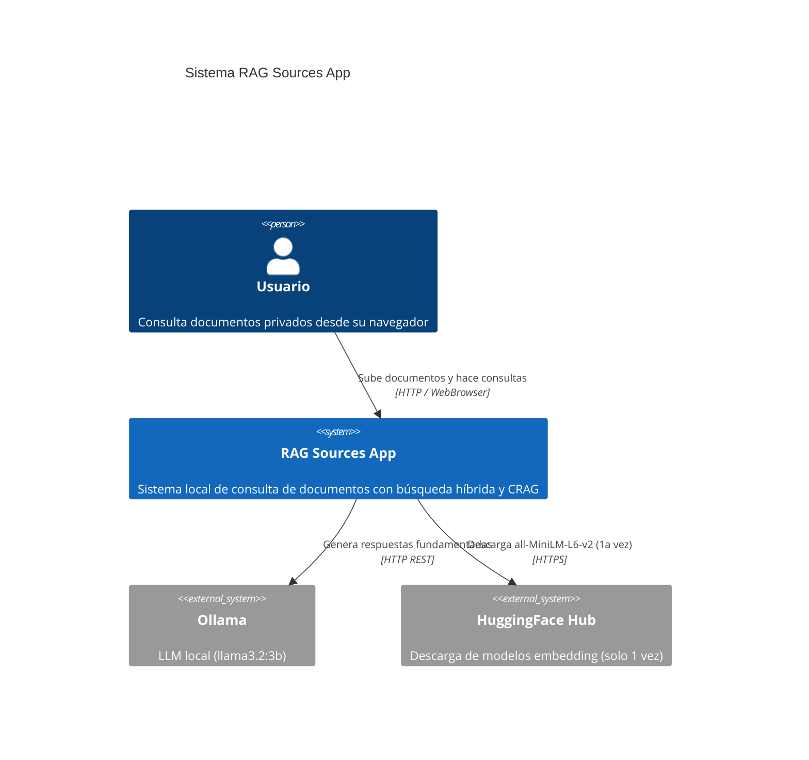
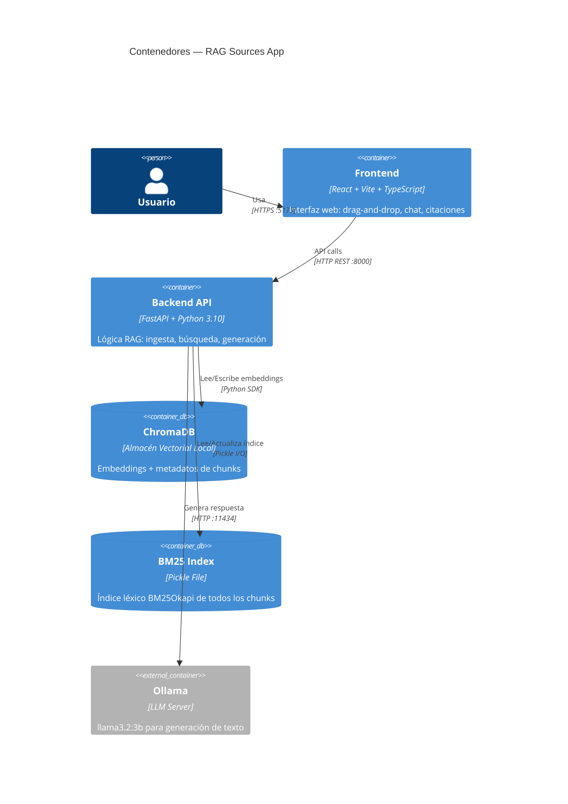
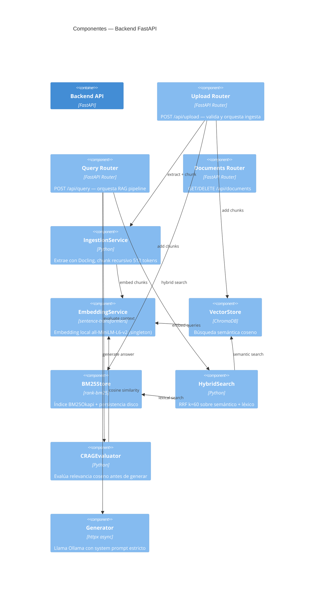
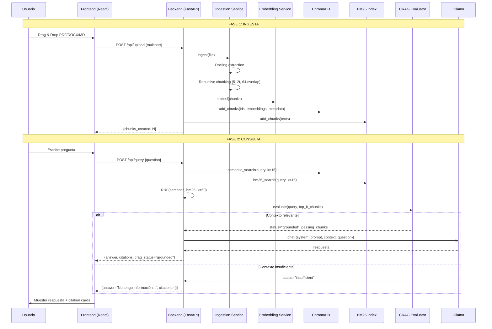

# C4 Architecture — RAG Sources App

## Level 1: System Context

```mermaid
C4Context
  title Sistema RAG Sources App

  Person(user, "Usuario", "Consulta documentos privados desde su navegador")

  System(rag, "RAG Sources App", "Sistema local de consulta de documentos con búsqueda híbrida y CRAG")

  System_Ext(ollama, "Ollama", "LLM local (llama3.2:3b)")
  System_Ext(hf, "HuggingFace Hub", "Descarga de modelos embedding (solo 1 vez)")

  Rel(user, rag, "Sube documentos y hace consultas", "HTTP / WebBrowser")
  Rel(rag, ollama, "Genera respuestas fundamentadas", "HTTP REST")
  Rel(rag, hf, "Descarga all-MiniLM-L6-v2 (1a vez)", "HTTPS")
```

## Level 2: Container Diagram

```mermaid
C4Container
  title Contenedores — RAG Sources App

  Person(user, "Usuario")

  Container(frontend, "Frontend", "React + Vite + TypeScript", "Interfaz web: drag-and-drop, chat, citaciones")
  Container(backend, "Backend API", "FastAPI + Python 3.10", "Lógica RAG: ingesta, búsqueda, generación")
  ContainerDb(chromadb, "ChromaDB", "Almacén Vectorial Local", "Embeddings + metadatos de chunks")
  ContainerDb(bm25, "BM25 Index", "Pickle File", "Índice léxico BM25Okapi de todos los chunks")
  Container_Ext(ollama, "Ollama", "LLM Server", "llama3.2:3b para generación de texto")

  Rel(user, frontend, "Usa", "HTTPS :5173")
  Rel(frontend, backend, "API calls", "HTTP REST :8000")
  Rel(backend, chromadb, "Lee/Escribe embeddings", "Python SDK")
  Rel(backend, bm25, "Lee/Actualiza índice", "Pickle I/O")
  Rel(backend, ollama, "Genera respuesta", "HTTP :11434")
```

## Level 3: Component Diagram (Backend)

```mermaid
C4Component
  title Componentes — Backend FastAPI

  Container(api, "Backend API", "FastAPI")

  Component(upload_api, "Upload Router", "FastAPI Router", "POST /api/upload — valida y orquesta ingesta")
  Component(query_api, "Query Router", "FastAPI Router", "POST /api/query — orquesta RAG pipeline")
  Component(docs_api, "Documents Router", "FastAPI Router", "GET/DELETE /api/documents")

  Component(ingestion, "IngestionService", "Python", "Extrae con Docling, chunk recursivo 512 tokens")
  Component(embeddings, "EmbeddingService", "sentence-transformers", "Embedding local all-MiniLM-L6-v2 (singleton)")
  Component(vector, "VectorStore", "ChromaDB", "Búsqueda semántica coseno")
  Component(bm25_svc, "BM25Store", "rank-bm25", "Índice BM25Okapi + persistencia disco")
  Component(hybrid, "HybridSearch", "Python", "RRF k=60 sobre semántico + léxico")
  Component(crag, "CRAGEvaluator", "Python", "Evalúa relevancia coseno antes de generar")
  Component(generator, "Generator", "httpx async", "Llama Ollama con system prompt estricto")

  Rel(upload_api, ingestion, "extract + chunk")
  Rel(upload_api, vector, "add chunks")
  Rel(upload_api, bm25_svc, "add chunks")
  Rel(query_api, hybrid, "hybrid search")
  Rel(hybrid, vector, "semantic search")
  Rel(hybrid, bm25_svc, "lexical search")
  Rel(query_api, crag, "evaluate context")
  Rel(query_api, generator, "generate answer")
  Rel(ingestion, embeddings, "embed chunks")
  Rel(vector, embeddings, "embed queries")
  Rel(crag, embeddings, "cosine similarity")
```

## Flujo de Datos Completo

```mermaid
sequenceDiagram
  participant U as Usuario
  participant FE as Frontend (React)
  participant BE as Backend (FastAPI)
  participant ING as Ingestion Service
  participant EMB as Embedding Service
  participant VEC as ChromaDB
  participant BM25 as BM25 Index
  participant CRAG as CRAG Evaluator
  participant LLM as Ollama

  Note over U,LLM: FASE 1: INGESTA
  U->>FE: Drag & Drop PDF/DOCX/MD
  FE->>BE: POST /api/upload (multipart)
  BE->>ING: ingest(file)
  ING->>ING: Docling extraction
  ING->>ING: Recursive chunking (512t, 64 overlap)
  BE->>EMB: embed(chunks)
  BE->>VEC: add_chunks(ids, embeddings, metadata)
  BE->>BM25: add_chunks(texts)
  BE-->>FE: {chunks_created: N}

  Note over U,LLM: FASE 2: CONSULTA
  U->>FE: Escribe pregunta
  FE->>BE: POST /api/query {question}
  BE->>VEC: semantic_search(query, k=15)
  BE->>BM25: bm25_search(query, k=15)
  BE->>BE: RRF(semantic, bm25, k=60)
  BE->>CRAG: evaluate(query, top_k_chunks)
  alt Contexto relevante
    CRAG-->>BE: status="grounded", passing_chunks
    BE->>LLM: chat({system_prompt, context, question})
    LLM-->>BE: respuesta
    BE-->>FE: {answer, citations, crag_status="grounded"}
  else Contexto insuficiente
    CRAG-->>BE: status="insufficient"
    BE-->>FE: {answer="No tengo información...", citations=[]}
  end
  FE->>U: Muestra respuesta + citation cards
```
