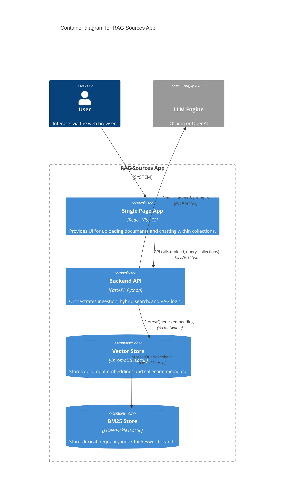

# C4 Container Diagram

The **RAG Sources App** consists of a React frontend and a FastAPI backend, using local persistence for both vector and lexical data.

## Containers Description

- **SPA (React)**: Handles the "Multi-Chat" experience. Maintains the state of the `activeCollection` and scopes all API requests to it.
- **Backend API (FastAPI)**: The brain of the application. It applies the "Multi-Context" isolation by partitioning the database queries using the `collection_name` metadata.
- **ChromaDB**: An embedded vector database that runs in-process. It stores the document chunks and provides semantic similarity search.
- **BM25 Store**: A custom lexical index implemented with `rank-bm25`. Optimized for keyword relevance.
- **LLM Engine**: The final generation stage. It is "blind" to the original files, receiving only the specifically selected and evaluated (via CRAG) text fragments.
