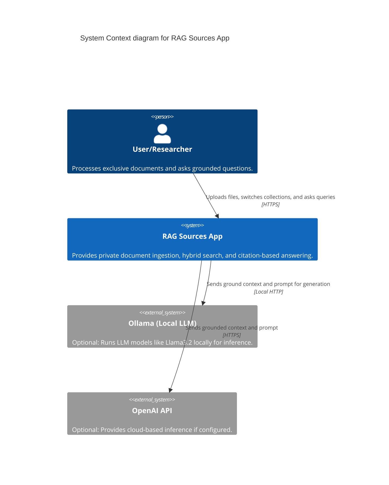

# C4 Context Diagram

## System Overview
The **RAG Sources App** allows users to upload exclusive documents and query them using a local AI pipeline. It ensures maximum privacy by processing everything on the user's machine.

## Key Personas
- **User/Researcher**: Needs to extract reliable information from specific document sets (PDF, DOCX, MD) without data leakage.

## System Boundaries
- **Internal**: Document extraction (Docling), local vector storage (ChromaDB), ranking (BM25 + RRF).
- **External**: LLM Inference (Ollama or OpenAI).
